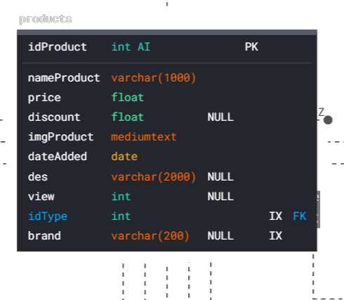
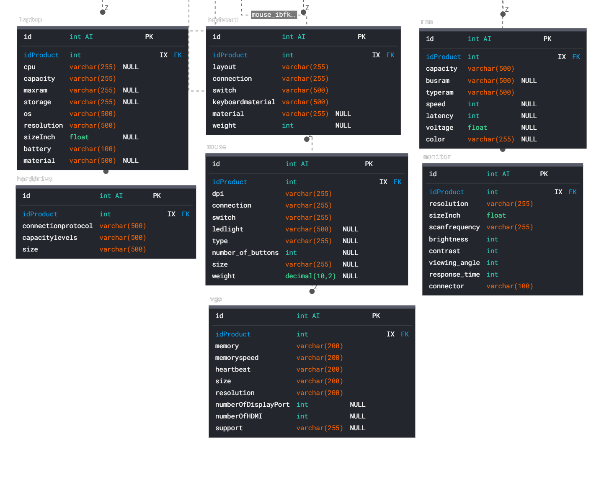

# Express server
This is a simple server using Express js and MySQL

## Install
```
npm install
```

## Run server

```
nodemon index.js
```
The server will run on port 1705. You can access the server at http://localhost:1705.

- Before getting to the endpoints, I will show you how to send data to those endpoints
```
fetch('url/endpoint',{
    method:'POST' || 'PUT' || 'PATCH' || 'DELETE'
    headers:{
        'Content-Type':'application/json',
        'Authorization':'Bearer token'
    },
    body:JSON.stringify(body data)
})
```
-If a list exists in the endpoint, the body will look like this:
```
body:JSON.stringify(list:[This will contain the ids],...)
```
## Endpoint list
### User 
- The endpoint for the user is started with : `/user`
    * Get user: `/`
        * Demo: 
        ```
        fetch('http://localhost:1705/api/user/',{
            method:'POST',
            headers:{
                'Content-Type':'application/json',
                'Authorization': 'Bearer token'
            }
        })
        ```
    * Get user by role: `/role/:role`
    * Get user has a role different from the role on the path: `/role/diff/:role`
    * Change information of user: `api/user/change/info`
        * Demo
        ```
        fetch('http://localhost:1705/api/user/change/info',{
            method:'POST',
            headers:{
                'Content-Type':'application/json',
                'Authorization': 'Bearer token'
            },
            body:JSON.stringify({name:'newName',phone:'012345678',email:'email@gmail.com'})
        })
        ```
    * Change role user: `/change/role/:newRole`
        * This is the part to change user rights in the admin page
         - Classify roles in the web:
            + 0 is Admin
            + 1 is Staff
            + 2 is User
        * Changing roles can only be done by accounts with role 0
        * Demo
        ```
        fetch('http://localhost:1705/api/user/change/role/1',{
            method:'POST',
            headers:{
                'Content-Type':'application/json',
                'Authorization': 'Bearer token'
            },
            body:JSON.stringify({idUser:'idUser1'})
        })
        ```
        This section changes the user role from 2 to 1

    * Change role by list : `/change/list/role/newRole`
        * Demo
        ```
        fetch('http://localhost:1705/api/user/change/role/1',{
            method:'POST',
            headers:{
                'Content-Type':'application/json',
                'Authorization': 'Bearer token'
            },
            body:JSON.stringify({list:['idUser1','idUser2','idUser3',]})
        })
        ```
### Product
- The endpoint for product is started with: `/api/product`
    * Get all product: `/` - method:'GET'
    * Get new product: `/new` - method:'GET'
    * Get product by name type: `/type/:nameType` - method:'GET'
    * Get detail product: `/detail/get/:idType/:idProduct` - method:'GET'
    * Search || Get product by keyword: `/search/:keyword` - method:'GET'
    * Add new product: `/insert` - method:'POST'
        
            * The information that needs to be posted to the products table:
                - Name product
                - Price
                - Image
                - Date Added
                - Id type
                - Brand
        
        * Demo:
        ```
        fetch('http://localhost:1705/api/product/insert',{
            method:'POST',
            headers:{
                'Content-Type':'application/json'
            },
            body:JSON.stringify({folder:'product',
                product:['Msi Bravo',1200,'image name (img.png || img.jpeg) from folder','2023-09- 05',1,'msi'],
                detail:['Amd','16GB',32,'512GB','Windows 11 Home','1920x1080',15.6,'53Wh','Vỏ nhựa']
            })
        })
        ```
    * Update product: `/update/:idType/:idProduct` - method:'PUT' - (Update basic product information || Cập nhật thông tin cơ bản của sản phẩm.)
        The data update part of product details you need to enter in order from top to bottom according to the corresponding table as shown in the image above.
        * Demo:
        Update data for a product whose type is 1 corresponding to the laptop table
        ```
        fetch('http://localhost:1705/api/product/update/1/21',{
            method:'PUT',
            headers:{
                'Content-Type':'application/json'
            },
            body:JSON.stringify({
                folder:'product',
                product:['Msi Bravo',1200,'old url image or new image name (img.png || img.jpeg) from folder','2023-09- 05',1,'msi'],
                detail:['Amd','16GB',32,'512GB','Windows 11 Home','1920x1080',15.6,'53Wh','Vỏ nhựa']
            })
        })
        ```
    * Delete product: `/delete/:idProduct` - method:'DELETE'
    * Delete product in list: `/list/delete` - method:'DELETE'
        * Demo:
        ```
        fetch('http://localhost:1705/api/product/list/delete',{
            method:'DELETE',
            headers:{
                'Content-Type':'application/json'
            },
            body:JSON.stringify({list:[1,4,16,5,22]})
        })
        ```
### Cart
- The endpoint for cart is started with: `/api/cart`
    * Get cart by id user: `/` - method:'GET'
    * Add product to cart of user: `/add` - method:'POST'
    * Get list product in cart: `/list` - method:'POST'
        * Body Data
            ```
                body:JSON.stringify({list:[]})
            ```
    * Change count product in cart: `/change` - method:'PATCH'
    * Delete all product in cart of user: `/delete` - method:'DELETE'
    * Delete product in cart: `/delete/:idCart` - method:'DELETE'
    * Delete list product in cart: `/list/delete` - method:'DELETE'
        * Body Data
            ```
                body:JSON.stringify({list:[]})
            ```
### Transports
- The endpoint for transports is started with: `/api/transports`
    * Get all transports: `/` - method:'GET'
    * Get transports by id: `/get/:idTrans` - method:'GET'
    * Insert one: `/insert` - method:'POST'
        * Body Data:
            ```
                headers:{
                    'Content-Type':'application/json',
                    'Authorization':'Bearer token'
                }
                body:JSON.stringify({listIdCart:[1,2],info:{name:'Name',phone:'0123456789',address:'your 
                    address',costs:0.85,method:'credit card'}})
            ```
    * Update status order: `/update/:idTrans` - method:'PATCH'
    * Delete all product in the order: `/delete/all/:idTrans` - method:'DELETE',
    * Delete one or more products in an order: `/delete/detail` - method:'DELETE'
        * Demo
        ```
        body:JSON.stringify({idTrans:'idTransDemo11',idTransDetail:[1,4]})
        ``` 
    * Insert data to bills table: `/success` - method:'POST'
        * Demo
        ```
        fetch('http://localhost:1705/api/transports/success',{
            method:'POST',
            headers:{
                'Content-Type':'application/json'
            },
            body:JSON.stringify({id:'idTransDemo1'})
        })
        ```
    * Insert data to failOrder table: `/fail` - method:'POST'
        * Demo
        ```
        fetch('http://localhost:1705/api/transports/fail',{
            method:'POST',
            headers:{
                'Content-Type':'application/json'
            },
            body:JSON.stringify({id:'idTransDemo1'})
        })
        ```


### Comment
- The endpoint for comment is started with: `/api/comment`
    * Get all comment: `/` - method:'GET'
    * Get comment by product: `/product/:idProduct` - method:'GET'
    * Insert comment by product: `/insert/:idProduct` - method:'POST'
        * Demo
        ```
        {
            method:'POST',
            headers:{
                'Content-Type':'application/json',
                'Authorization':'Bearer token'
            },
            body:JSON.stringify({value:'This is comment value',date:'2023-10-11'})
        }
        ```
    * Get comment by user: `/user` - method:'POST'
    * Delete one comment: `/delete/:idComment` - method:'DELETE'
    * Delete comment in list: `/list/delete` - method:'DELETE'
        * Body Data :
        ```
            body:JSON.stringify({list:[1,2,4,5]})
        ```
### Warehouse
- The endpoint for warehouse is started with: `/api/ware`
    * Get all: `/` - method:'GET'
    * Get total product in warehouse: `/total` - method:'GET'
    * Get warehouse by status: `/status` - method:'POST'
    * Insert data to warehouse:`/insert` - method:'POST'
### Auth
- The endpoint for auth is started with: `/auth`
    * Login: `/login` - method:'POST'
    * Register: `/register` - method:'POST'
    * Get new token : `/new/token` - method:'POST'
    * Forgot password : `/forgot` - method:'POST'
### Restart
- There is also an endpoint used to restart the server: `/restart` - method:'GET'
### Upload image to S3
-And endpoint for save image : `/upload/:folder` - method:'POST'
* DEMO FETCH API FOR UPLOAD:
```
    <div style="display:flex;flex-direction:column">
        <input type="file" id="inputFile"/>
        <button onclick="getFile()" style="width:100px;height:30px;margin-top:20px">Send img</button>
    </div>
    <script>
        const getFile = () => {
        const result = document.getElementById('inputFile');
        const data = new FormData();
        data.append('file', result.files[0]);
        console.log(result.files[0])
        fetch('/upload',{
            method:'POST',
            body:data
        })
        .then(res => {return res.json()})
        .then(res => console.log(res))
        }
    </script>
```